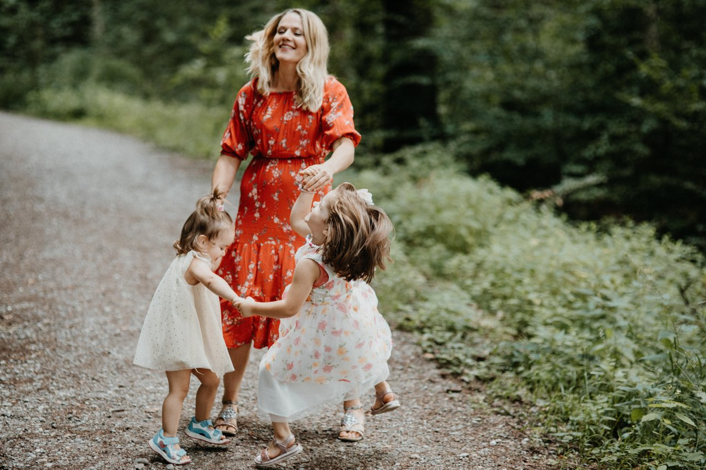
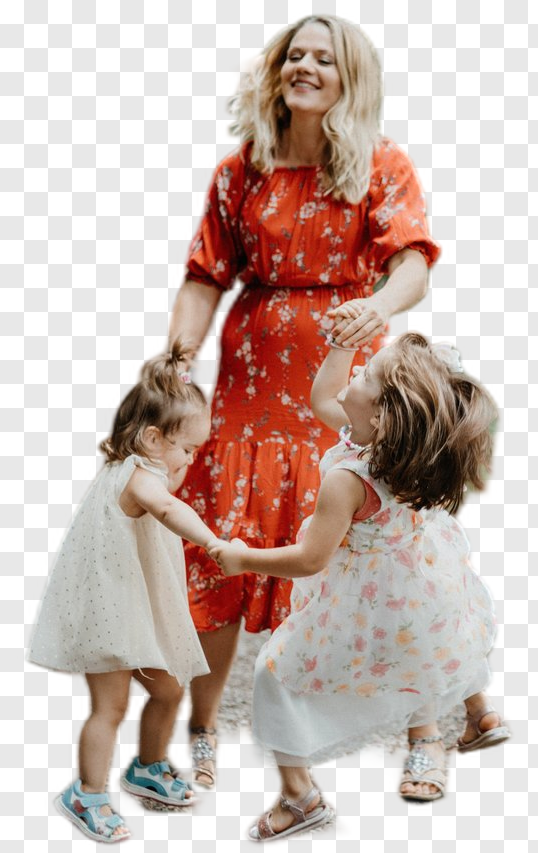

# cleanbg

Local background removal for photos. The person or object stays; everything else becomes transparency.

Inference is [rembg](https://github.com/danielgatis/rembg) running ONNX models on your machine. Nothing is uploaded. This package adds a small API, a CLI, batch processing, subject crop, and optional background replacement.

## Demo

`u2net_human_seg` on a family photo. Left is the original; right is the cutout.

| Before | After |
| --- | --- |
|  |  |

```bash
cleanbg before.jpg --model u2net_human_seg --crop --decontaminate -o after.png
```

Photo via [Pixabay](https://pixabay.com), [Content License](https://pixabay.com/service/license-summary/).

## Install

Python 3.11+.

```bash
pip install -e .
```

Later, from PyPI:

```bash
pip install cleanbg
```

The first run downloads `u2net` (~176 MB) into `~/.rembg/models/`. NVIDIA GPU:

```bash
pip install -e ".[gpu]"
```

## CLI

```bash
cleanbg photo.jpg
cleanbg photo.jpg -o cutout.png
cleanbg shots/ -o out/
cleanbg portrait.jpg --model u2net_human_seg --crop
cleanbg product.jpg --bg "#FFFFFF" --crop -o product.png
cleanbg subject.jpg --bg studio.jpg -o composite.png
cleanbg --list-models
```

`python -m cleanbg` does the same.

## Library

```python
from cleanbg import remove_background

image = remove_background("photo.jpg", "photo.png")
```

`source` can be a path, `Path`, `PIL.Image`, bytes, or an open file. Skip `output` if you only want the image object.

For a folder, load the model once:

```python
from cleanbg import BackgroundRemover

remover = BackgroundRemover("isnet-general-use")
for item in remover.remove_many("shots/", "out/", recursive=True):
    print(item.source, "->", item.output)
```

Replace the background instead of leaving it transparent:

```python
remove_background(
    "group.jpg",
    "group.png",
    model="u2net_human_seg",
    crop=True,
    background="#F5F5F5",
)
```

## Models

| Name | Use when |
| --- | --- |
| `u2net` | default — fast, general |
| `u2netp` / `silueta` | little RAM or disk |
| `u2net_human_seg` | people |
| `isnet-general-use` | products and objects |
| `birefnet-portrait` | portraits, hair |
| `birefnet-general` | quality over speed |
| `isnet-anime` | illustration |
| `bria-rmbg` | highest quality; **BRIA license is not free for commercial use** |

Weights are downloaded by rembg and keep their own licenses. This repo is MIT; check the model before you ship a product.

Copy-paste recipes: [USAGE.md](USAGE.md). Runnable scripts live in `examples/`.

## License

MIT © [Franz Huayta Quevedo](https://github.com/fhuayta).

Segmentation via [rembg](https://github.com/danielgatis/rembg) (MIT) by Daniel Gatis.
